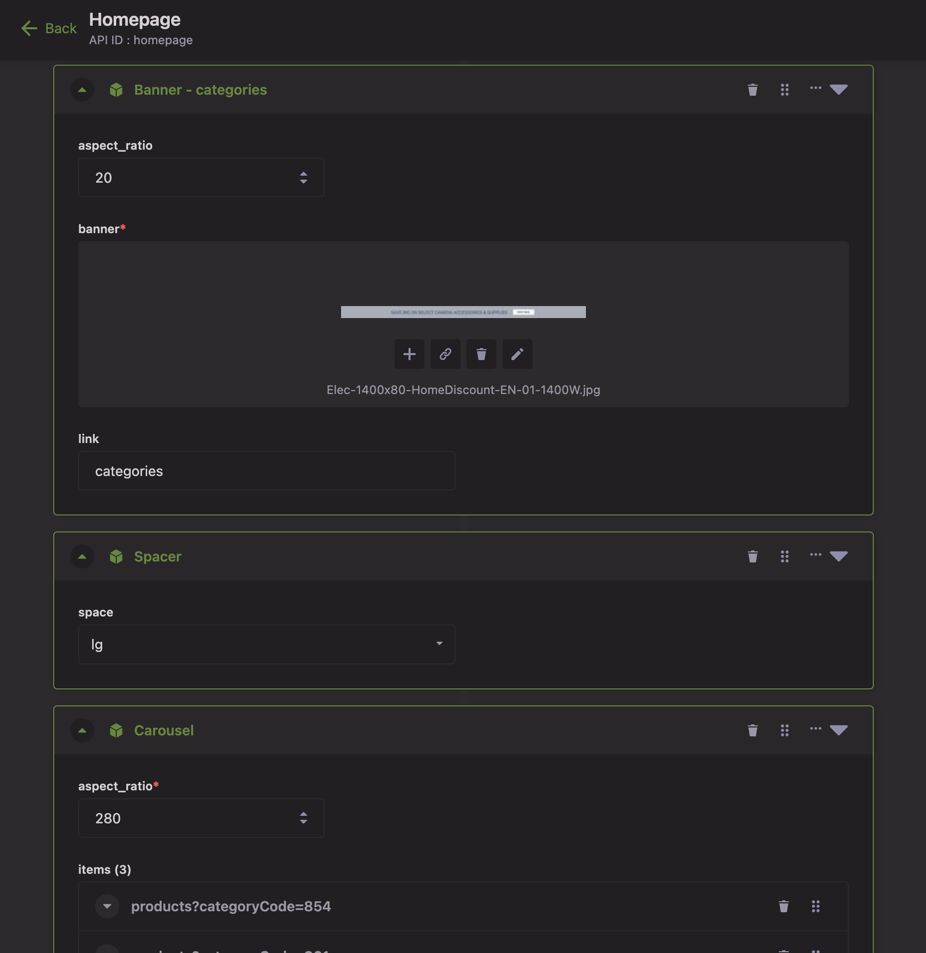
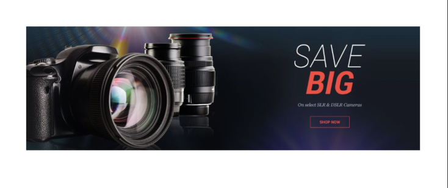
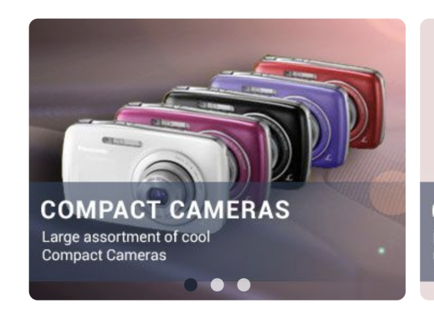
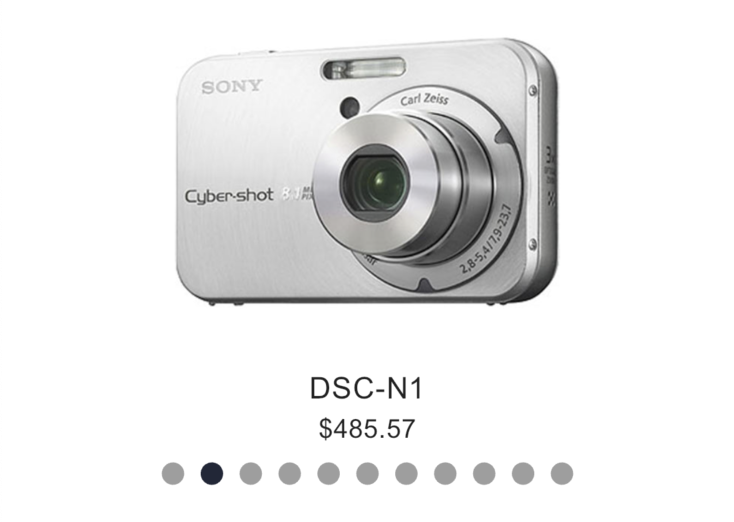

This page walks you through the process of content administration. This feature allows you to display native content that is remotely administrated in Strapi CMS.

The core of the feature relies on the concept of [Dynamic Zone](https://docs.strapi.io/dev-docs/api/entity-service/components-dynamic-zones) in Strapi. A dynamic zone is made of instances of pre-defined components in Strapi.

Flex Storefront contains the Flex UI counterpart for each of these components, allowing administrators to quickly and easily declare app content that will be shown in the app.

## Prerequisites
- Basic understanding of Flutter development.
- Access to a Strapi CMS instance with the Flex components declared.
- Flutter development environment set up.

## Content declaration

- In the Strapi console, open _Content-Type Builder_, then in the secondary menu: _Create new single type_
- Give it a name (ex: "Homepage") and validate.
- Define a field of type _Dynamic zone_ named "content"
- Click on "Add components to the zone" then "Use an existing component"
- Select all the components from the list and hit "Finish", then "Save" (the Strapi instance is restarting)
- Go the "Content Manager" section and select the Single Type content newly created (ex: "Homepage")
- Build your content by declaring instances of the available components. Example:



## Flutter implementation

Flex Storefront provides a default widget renderer for each component:

| Model               | Widget                          | Example                                             |
|---------------------|---------------------------------|-----------------------------------------------------|
| SpacerData          | SizedBox                        | /                                                   |
| HeaderData          | Text                            |            |
| BannerData          | SelectableImage                 |            |
| CarouselData        | FlexCarousel                    |          |
| ProductCarouselData | FlexCarousel + ProductListCubit |  |

## Steps

- In the page containing the CMS content, declare a `BlocProvider` and instantiate a `CmsCubit`, the cubit needs the code of the single type. It is the API ID shown in the Strapi admin console (with our example: `homepage`):

```dart
BlocProvider<CmsCubit>(
  create: (_) => CmsCubit('homepage')..loadContent(),
  child: ...,
)
```

- Define a `BlocBuilder<CmsCubit, CmsState>` at the location you want the content to be displayed. The `state` variable contains a list of `CmsData` model instances, one for each component that has been declared in Strapi admin console. Flex Storefront provides a default widget renderer for each component:

```dart
BlocBuilder<CmsCubit, CmsState>(
  builder: (_, state) {
    final widgets = sections.map((section) {
      return CmsHelper.render(section);
    }

    return ListView(
      children: widgets;
    );
  },
)
```

- For more customization, it is possible to define your own custom widget(s):

```dart
BlocBuilder<CmsCubit, CmsState>(
  builder: (context, state) {
    final widgets = sections.map((section) {
      if (section is BannerData) {
        // Declare your own "banner" widget here
        return MyCustomClickageImage(
          url: section.media.url,
          onTap: () => context.router.navigateTo(section.link),
        );
      } else {
        return CmsHelper.render(section);
      }
    }

    return ListView(
      children: widgets;
    );
  },
)
```
