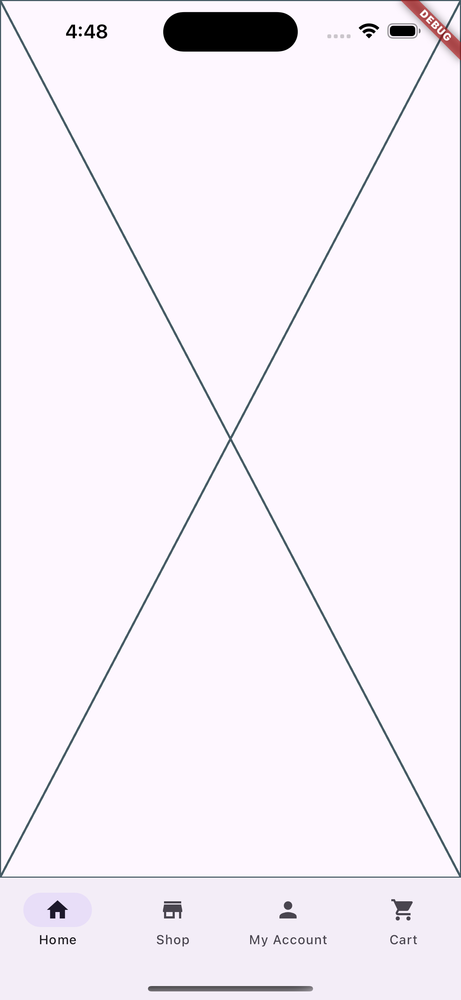

This guide will help you quickly set up and customize your mobile app project using the Flex Storefront accelerator.

## Prerequisites

Before you begin, ensure you have the following installed:

- [Flutter](https://docs.flutter.dev/get-started/install) (latest stable version)
- [Mason CLI](https://docs.brickhub.dev/installing/)
- [Git](https://git-scm.com/downloads)
- Your preferred IDE (we recommend VS Code or Android Studio)

Read the [requirements](/getting-started/requirements) section for full setup instructions.

## Installation Steps

### 1. Install Mason CLI

If you haven't already installed Mason CLI, run:
```zsh
# Activate mason_cli
dart pub global activate mason_cli
```

### 2. Create Your Project

```zsh
# Create a new directory for your project
mkdir my_storefront
cd my_storefront

# Initialize Mason
mason init

# Add the flex_storefront brick
mason add flex_storefront --git-url git@github.com:flex-storefront/flex_starter.git --git-path bricks/storefront/
```

Running the above command will automatically install the `flex_storefront` brick in the current workspace and update the `mason.yaml`:

```yaml
bricks:
  flex_storefront:
    git:
      url: 'git@github.com:flex-storefront/flex_starter.git'
      path: 'bricks/storefront/'
```

Now, you can use the `make` command to generate the storefront code from the brick:

```zsh
# Generate your project
mason make flex_storefront
```

If the brick was installed successfully, you should see the Flutter project structure files and folders. We can now install the app dependencies:

```zsh
flutter pub get
```

Let's go ahead and run your Storefront App! You're now ready to start development 🎉



## What's next?

### Set environment variables

In order for Flex Storefront to connect to your backend Commerce instance, you will need to provide certain environment variables.

### Understanding the folder structure

Coming soon.
