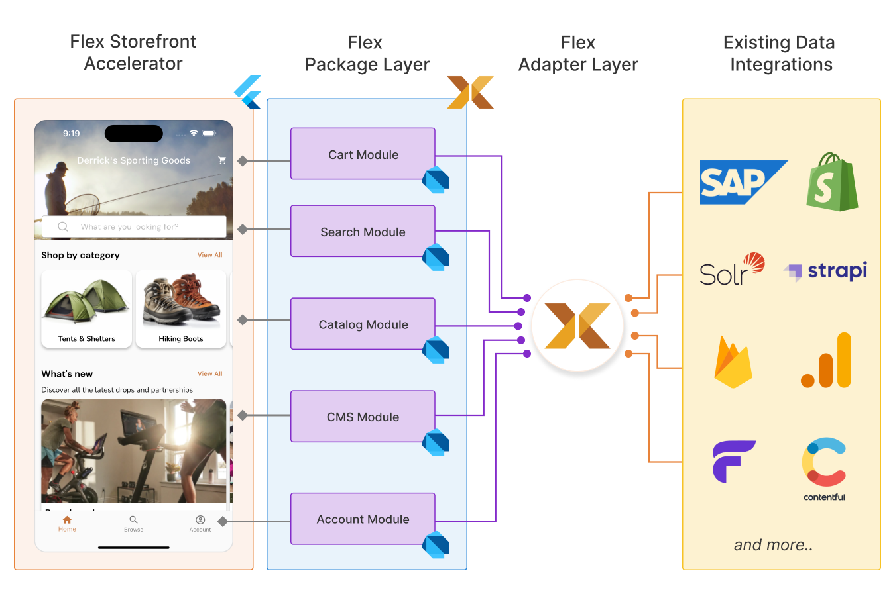

The Flex platform is separated into three layers:
- **Flex Storefront Accelerator** - a single codebase written in Flutter to build apps for iOS, Android and more
- **Flex Package Layer** - modular packages written in Dart to support each Flex feature
- **Flex Adapter Layer** - official and 3rd party APIs and adapters to connect with a variety of headless backends

Below is a high level overview of how each of the three layers work with your existing commerce systems.

